# WeirdSpace

<p>
  
  [huge_mountains2.webm](https://github.com/SomePersonFromMars/WeirdSpace/assets/42392219/28471047-9cc5-45b6-afcc-37abf861082b)
  
  <div align="center"> <em> Nice landscape from the game. </em> </div>
</p>

<br/>

The concept for this game is to create it "by hand", meaning no game engine is used. My goal is to write code optimized specifically for this game, minimizing the use of external code. When external code is used, it is highly specific and unlikely to need further optimization.

For now, this is a simple voxel-based, Minecraft-like draft of an open-world adventure game. A quite good map (planet) generator has also been implemented.

I have many plans for the game's content, but I prefer not to reveal too much until I have time to implement them, as I develop this code in my spare time.

All I can say for now is that the *space* in this game is going to be *weird*.

<br/>
<br/>

# Contents
- [WeirdSpace](#weirdspace)
- [Contents](#contents)
- [Showcase of Implemented Features](#showcase-of-implemented-features)
- [How to Run This Code](#how-to-run-this-code)
- [How to Build It](#how-to-build-it)
  - [Debian-Based Linux Distros](#debian-based-linux-distros)
  - [Windows](#windows)
    - [Enable Symbolic Links Support](#enable-symbolic-links-support)
    - [Required Software](#required-software)
    - [Compilation](#compilation)
  - [Other OSes/IDEs/Platforms](#other-osesidesplatforms)
- [Credits](#credits)
  - [External Libraries Used in This Project](#external-libraries-used-in-this-project)
  - [Sources of Knowledge and Code Samples Used in This Project](#sources-of-knowledge-and-code-samples-used-in-this-project)

<br/>
<br/>

# Showcase of Implemented Features
Currently, the world consists only of deserts. Basic lighting and a [fog effect](https://iquilezles.org/articles/fog/) have been implemented.

Each chunk is preprocessed before rendering in such a way that only potentially visible block faces are sent to the GPU. Such batch of faces is drawn using instancing to minimize data transfer. A chunk is rendered only if it fits within the [view frustum](https://learnopengl.com/Guest-Articles/2021/Scene/Frustum-Culling).

<p>
  <div align="center">
    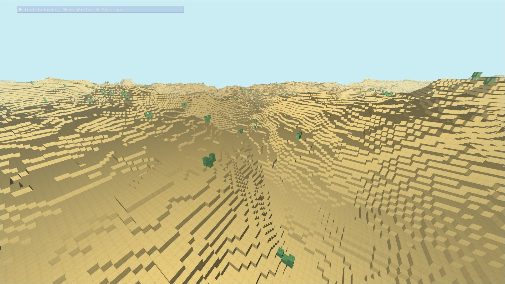
    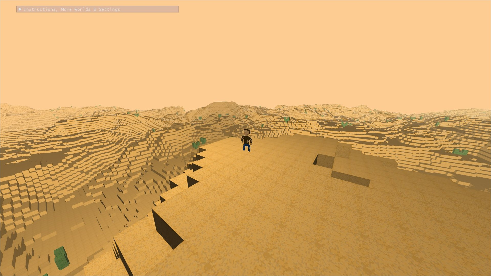
  </div>
  <div align="center">
    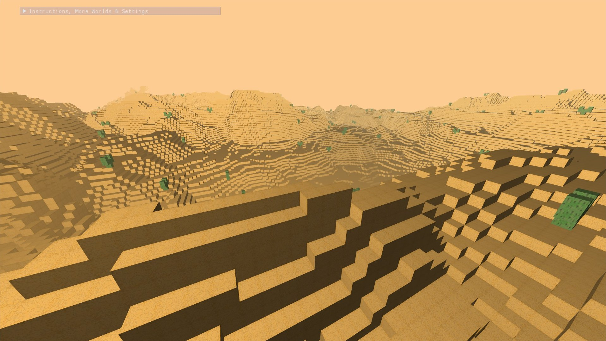
    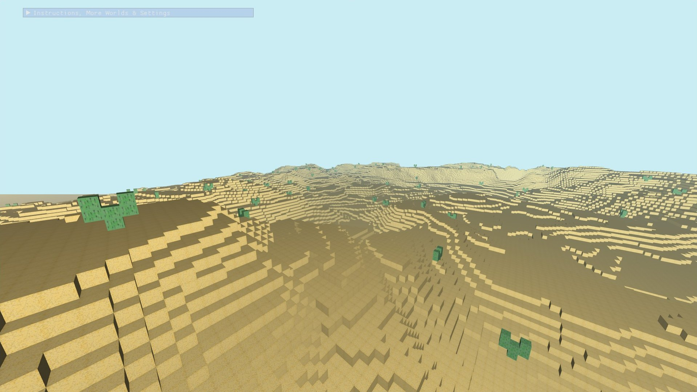
  </div>
  <div align="center">
    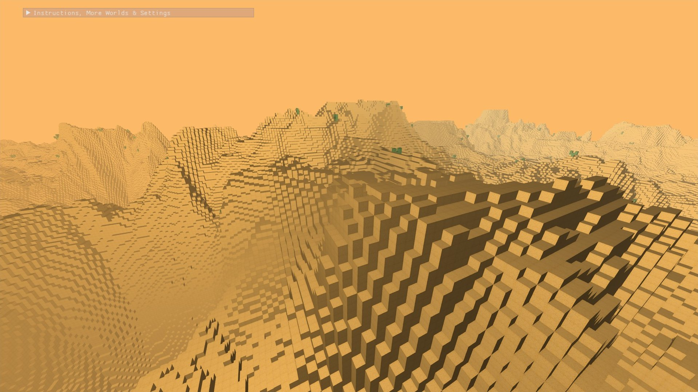
  </div>
  <div align="center">
    <em> Example worlds. </em>
  </div>
</p>
<br/>
<br/>

One of the *weird* concepts of this game is to mix 3D with 2D, so the player moves only in the XY plane.

<p>
  
  [walking_and_collisions.webm](https://github.com/SomePersonFromMars/WeirdSpace/assets/42392219/71f64cd8-5734-4aed-bdd6-0420dfb8da9f)
  
  <div align="center"> <em> Player movement and collisions. </em> </div>
</p>
<br/>
<br/>

The map generator can create maps with many continents of variable shapes and sizes using [Voronoi Diagrams](http://www-cs-students.stanford.edu/~amitp/game-programming/polygon-map-generation/). The landscapes are varied thanks to [Fractal Brownian Motion](https://thebookofshaders.com/13/). [River networks](https://github.com/dandrino/terrain-erosion-3-ways/tree/master?tab=readme-ov-file#river-networks) are also present. Humidity and temperature values are calculated using parameters like altitude, latitude, and distance from oceans and rivers. These values will help determine biomes in the future.

Maps are cyclic in the X-axis, allowing them to be projected onto a cylinder. This feature aligns with the weird concept of mixing 2D and 3D.

*Note: Many map generator features are not yet reflected in the rendered world.*

<p>
  <div align="center">
    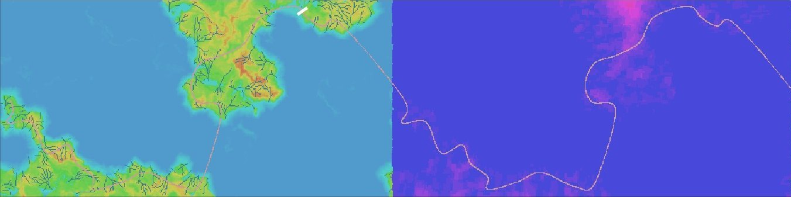
  </div>
  <br/>
  <div align="center">
    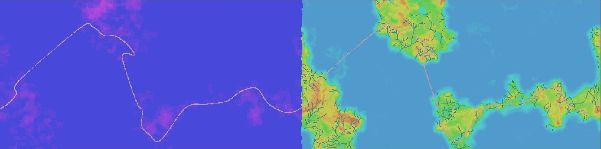
  </div>
  <div align="center">
    <em> Examples of maps generated by the multicore CPU map generator. Note the varying continents, landscape shapes, and river networks. <br/> The humidity map is also shown. </em>
  </div>
</p>
<br/>
<br/>

<p>
  <div align="center">
    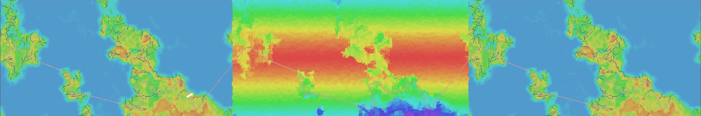
  </div>
  <div align="center">
    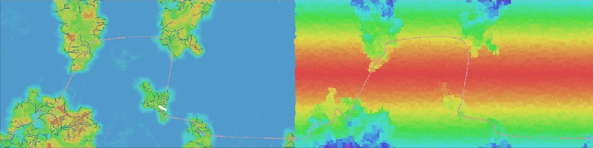
  </div>
  <br/>
  <div align="center">
    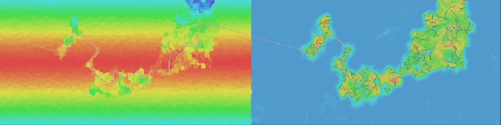
  </div>
  <div align="center">
    <em> Similar examples as before, but with temperature maps. </em>
  </div>
</p>
<br/>
<br/>

<p>
  <div align="center">
    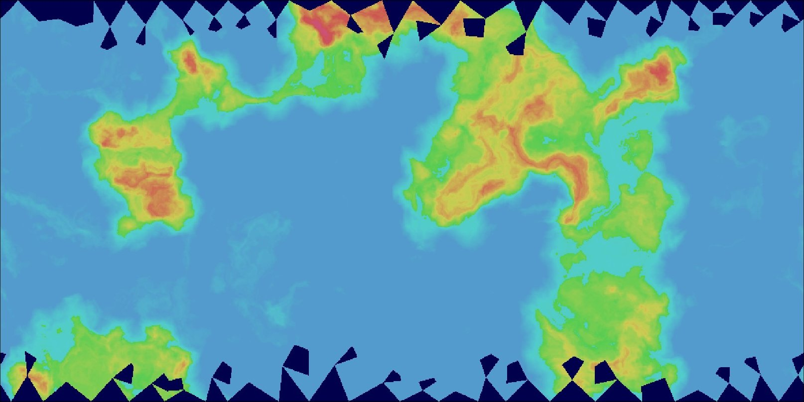
    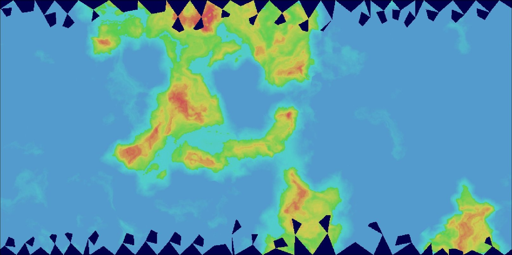
  </div>
  <br/>
  <div align="center">
    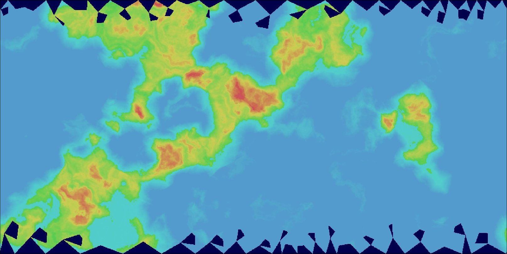
  </div>
  <div align="center">
    <em> Examples of maps generated by the faster GPU map generator. River networks, humidity, and temperature have not yet been implemented. </em>
  </div>
</p>
<br/>
<br/>

It is planned that the player will move not just in an XY plane but along a curve, as visualized in the generator playground, making the game even *weirder*:

<p>

  [continents_with_rivers1.webm](https://github.com/SomePersonFromMars/WeirdSpace/assets/42392219/96adfc2d-3afd-4243-af33-19fa23a6be47)
  
  <div align="center"> <em> Player moving along a predefined curve. </em> </div>
</p>
<br/>
<br/>

Generating maps on a GPU, instead of a CPU, allows for interesting features like dynamically evolving maps. This enables the creation of worlds that gradually change throughout gameplay (*weird*, isn't it?).

<p>

  [evolving_GPU_continents1.webm](https://github.com/SomePersonFromMars/WeirdSpace/assets/42392219/cf9a3ad0-eb56-4514-a4d8-538b7bf6a2c5)

  <br/>
  <br/>
  
  [evolving_GPU_continents2.webm](https://github.com/SomePersonFromMars/WeirdSpace/assets/42392219/dd4821a9-993a-4523-bbb5-197a697a6659)

  <br/>
  <div align="center"> <em> Map dynamically evolving due to GPU map generation. </em> </div>
</p>
<br/>
<br/>

Do not hesitate to try some features yourself! A GUI tool is available in the executables to tweak the settings. There are predefined presets with interesting settings and maps. Some settings are best viewed in the `weird_space` executable and others in the `generator_playground` executable, although both are compatible with both executables.

<p>
  <div align="center">
    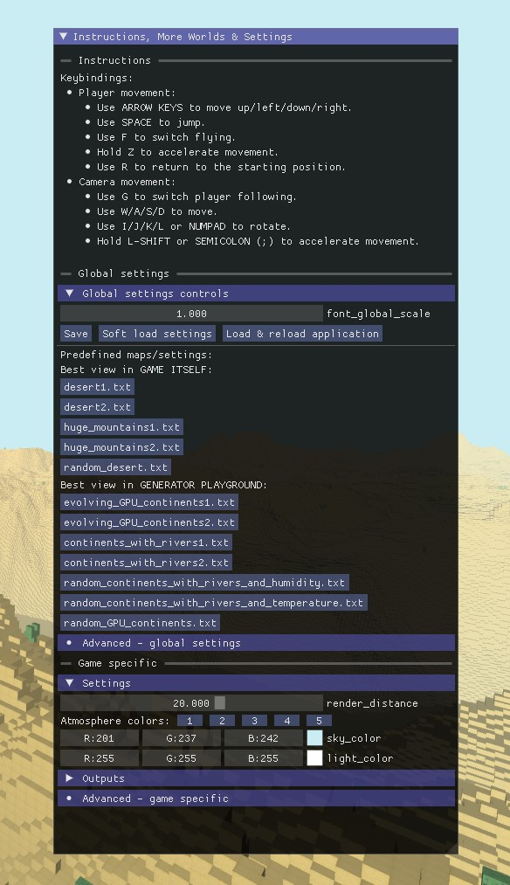
  </div>
  <div align="center">
    <em> Temporary debug GUI showcase. </em>
  </div>
</p>
<br/>
<br/>

# How to Run This Code
All binaries for both Linux and Windows are available on the **Releases** page (note that the Windows binary requires a runtime to be installed as described there).

<br/>
<br/>

# How to Build It
First, clone the repository:
```bash
git clone --recurse-submodules https://github.com/SomePersonFromMars/WeirdSpace.git
cd WeirdSpace
```
Then follow the platform-specific instructions.

## Debian-Based Linux Distros
```bash
# Required dependencies:
sudo apt-get install cmake make g++ libx11-dev libxi-dev libgl1-mesa-dev libglu1-mesa-dev libxrandr-dev libxext-dev libxcursor-dev libxinerama-dev libxi-dev

# Generate Makefiles:
mkdir build
cd build
cmake -DCMAKE_BUILD_TYPE=Release ..
```
To build and run the game:
```bash
cd game
make # Append -j for faster multicore compilation
./weird_space
```
To build and run the generator playground:
```bash
cd tools/generator_playground
make # Append -j for faster multicore compilation
./generator_playground
```

## Windows
### Enable Symbolic Links Support
As the repository uses symbolic links for compilation simplicity, you need to [enable them](https://stackoverflow.com/a/59761201):
1. Enable "Developer Mode" in Windows 10/11 - this gives `mklink` permissions.
2. Inside the repository directory, execute:
   ```batch
   git config core.symlinks true
   git reset --hard
   ```

### Required Software
Install Visual Studio 2022 with the "Desktop development with C++" packages.

### Compilation
Open the "x64 Native Tools Command Prompt for VS 2022" app and then:
1. Navigate to the cloned repository.
2. Create a build directory: `mkdir build`
3. Enter the build directory: `cd build`
4. Generate project files: `cmake -G "Visual Studio 17 2022" ..`
5. Open the Visual Studio Solution file: `start WeirdSpace.sln`
6. In the Solution Explorer, right-click on the `weird_space` or `generator_playground` target and click "Set as Startup Project."
7. You can now build the executable or build and run it.

## Other OSes/IDEs/Platforms
Instructions from [this tutorial](https://www.opengl-tutorial.org/beginners-tutorials/tutorial-1-opening-a-window/) will *probably* work.

<br/>
<br/>

# Credits
## External Libraries Used in This Project
* OpenGL extension loading: [GLEW](https://github.com/nigels-com/glew)
* Windows, input: [GLFW](https://www.glfw.org/)
* Math library: [GLM](https://github.com/g-truc/glm)
* Temporary debug GUI: [Dear ImGui](https://github.com/ocornut/imgui)
* Image loading: [stb](https://github.com/nothings/stb)
* CPU noise generation: [siv::PerlinNoise](https://github.com/Reputeless/PerlinNoise)
* Delaunay triangulation: [delaunator-cpp](https://github.com/delfrrr/delaunator-cpp)

## Sources of Knowledge and Code Samples Used in This Project
* OpenGL knowledge:
    * *OpenGL Superbible: Comprehensive Tutorial and Reference (7th Edition)*
    * [OpenGL Tutorial](http://www.opengl-tutorial.org/)
    * [Learn OpenGL](https://learnopengl.com/)
        - [Frustum Culling](https://learnopengl.com/Guest-Articles/2021/Scene/Frustum-Culling)
* Procedural generation:
    * [Polygon Map Generation by Red Blob Games](http://www-cs-students.stanford.edu/~amitp/game-programming/polygon-map-generation/)
    * GPU noise: [webgl-noise by Ashima](https://github.com/ashima/webgl-noise)
    * River networks inspired by [Daniel Andrino](https://github.com/dandrino/terrain-erosion-3-ways/tree/master?tab=readme-ov-file#river-networks)
    * [Fractal Brownian Motion from *The Book of Shaders*](https://thebookofshaders.com/13/)
    * [Fog effect by Inigo Quilez](https://iquilezles.org/articles/fog/)

<br/>
<br/>

```
Copyright (C) 2024, Kacper Orszulak
GNU General Public License v3.0+ (see LICENSE.txt or https://www.gnu.org/licenses/gpl-3.0.txt)
```
